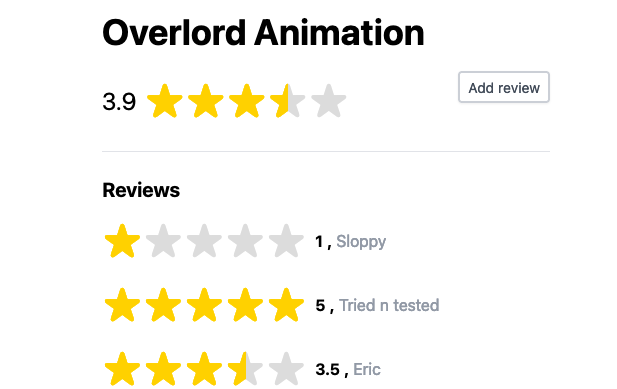
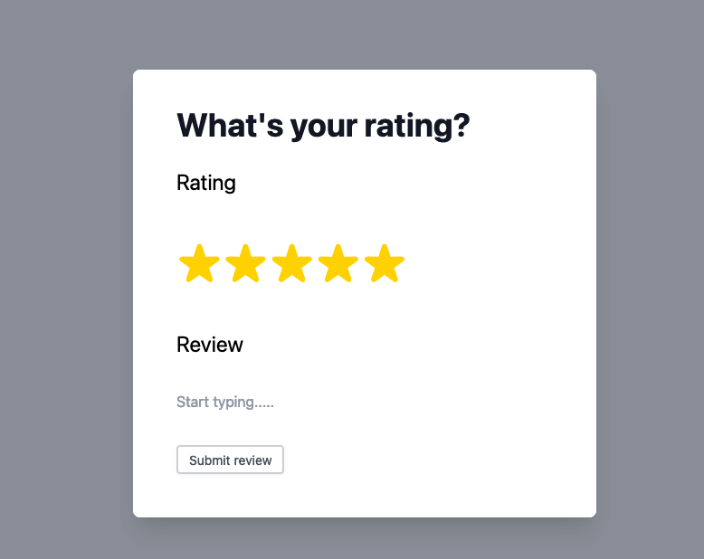

# Gumroad Coding Challenge v2

### To Run MVP:

- Clone this repo
- Checkout branch `mvp`
- Run `yarn install`
- Run `yarn dev`
- Once webpack is done compiling it will open the browser at `http:localhost:8080`

### To Run v2:

- Clone this repo
- Checkout branch `main`
- Run `yarn install`
- Run `yarn dev`
- Once webpack is done compiling it will open the browser at `http:localhost:8080`

